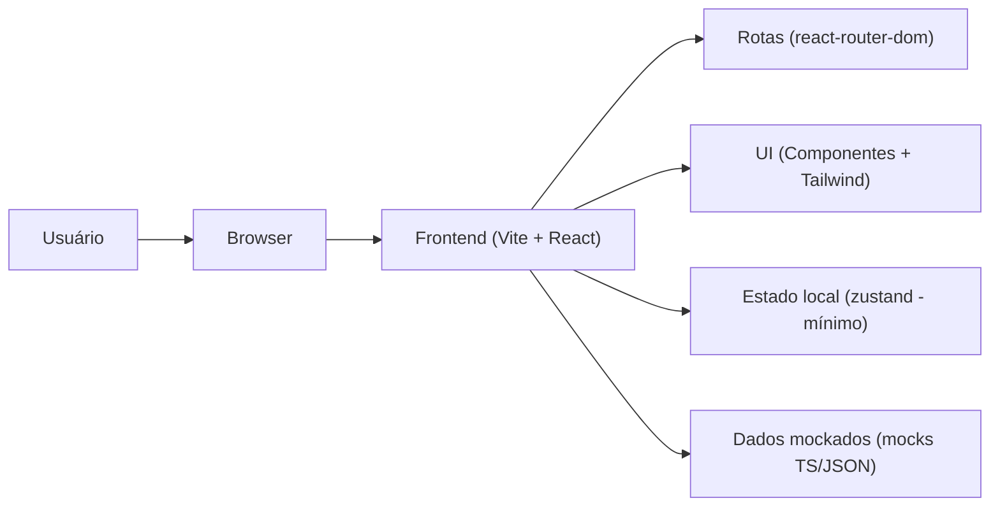
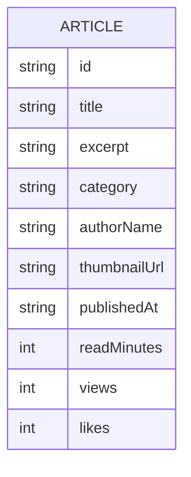

## 1. Desenho de Arquitetura

Aplicação frontend (SPA) em React com rotas para páginas principais, dados mockados localmente para viabilizar o layout fiel ao Figma sem dependências de backend neste primeiro ciclo.



## 2. Tecnologias
- Frontend: React@18 + Vite + TypeScript
- Estilo: Tailwind CSS (tokens via CSS variables quando necessário)
- Rotas: react-router-dom
- Estado: zustand (somente se necessário para preferências e UI state)
- Ícones: lucide-react
- Dados: mocks locais (sem backend neste escopo)

## 3. Definição de Rotas
| Rota | Objetivo |
|------|----------|
| / | Home (layout fiel ao Figma) |
| /artigos | Lista de artigos (UI inicial, placeholder) |
| /artigos/:slug | Detalhe do artigo (UI inicial, placeholder) |
| /entrar | Login (UI inicial) |
| /cadastrar | Cadastro (UI inicial) |

## 4. APIs (não aplicável neste escopo)
Neste ciclo, o projeto não terá backend. A UI consumirá um conjunto de dados local para renderização de cards e seções da home.

## 5. Modelo de Dados (mock)

### 5.1 Definição de Entidades


### 5.2 Contratos em TypeScript (frontend)
```ts
export type Article = {
  id: string
  title: string
  excerpt: string
  category: string
  authorName: string
  thumbnailUrl: string
  publishedAt: string
  readMinutes: number
  views: number
  likes: number
}
```
