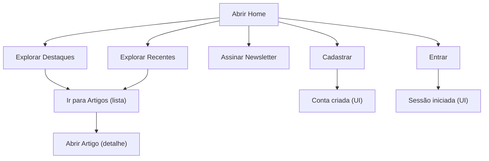

## 1. Visão Geral do Produto
Blog de tecnologia com foco em IA, desenvolvimento e DevOps, com home editorial em tema escuro e destaque para artigos selecionados. O produto visa facilitar a descoberta de conteúdo e incentivar a criação/participação da comunidade.

- Público-alvo: pessoas desenvolvedoras, estudantes e profissionais de tecnologia
- Valor: curadoria + descoberta rápida + incentivo a escrita e assinatura de newsletter

## 2. Funcionalidades Principais

### 2.1 Papéis de Usuário (quando aplicável)
| Papel | Método de cadastro | Permissões principais |
|------|---------------------|----------------------|
| Visitante | Não aplicável | Navegar, ver listas e detalhes, assinar newsletter |
| Usuário | Email/senha | Tudo do visitante + criar artigos (futuro), salvar favoritos (futuro) |

### 2.2 Módulos por Página
1. **Home**: header com navegação, hero/CTA, seção de destaques, seção de recentes, bloco de newsletter, CTA de comunidade, footer
2. **Artigos (lista)**: listagem paginada/filtrável (placeholder inicial), cards consistentes com a home
3. **Artigo (detalhe)**: conteúdo do artigo (placeholder inicial) e metadados
4. **Entrar**: formulário de autenticação (UI inicial)
5. **Cadastrar**: formulário de criação de conta (UI inicial)

### 2.3 Detalhes das Páginas
| Página | Módulo | Descrição da funcionalidade |
|-------|--------|-----------------------------|
| Home | Header | Logo à esquerda, links “Home” e “Artigos”, ações “Entrar” (link) e “Cadastrar” (botão em destaque), tema escuro com separação sutil |
| Home | Hero | Título “Explore o Futuro da Tecnologia” com destaque em ciano, subtítulo em 2 linhas, 2 CTAs (primário “Explorar Artigos”, secundário “Começar a Escrever”) |
| Home | Artigos em Destaque | Título + subtítulo, link “Ver todos”, grid de cards (3 colunas no desktop) com imagem, categoria, data, título, resumo, autor e métricas |
| Home | Artigos Recentes | Título + subtítulo, grid de cards (3 colunas no desktop) com cards mais compactos |
| Home | Newsletter Semanal | Título, descrição curta, campo de email e botão “Inscrever”, texto auxiliar de privacidade/qualidade |
| Home | CTA Comunidade | Título “Compartilhe Seu Conhecimento”, texto de apoio, botão “Criar Conta Gratuita” |
| Home | Footer | Logo + microcopy, colunas de navegação e redes sociais, copyright |
| Artigos | Lista | Listagem com filtros (placeholder), cards reutilizados, paginação (placeholder) |
| Artigo | Detalhe | Cabeçalho do artigo, conteúdo em markdown/HTML (placeholder), blocos laterais (futuro) |
| Entrar | Form | Email/senha + botão, link para cadastro |
| Cadastrar | Form | Nome/email/senha + botão, link para entrar |

## 3. Fluxos Principais
Fluxos de navegação esperados:
- Visitante acessa a Home → explora “Artigos em Destaque” ou “Artigos Recentes” → abre lista de artigos ou detalhe (quando disponível)
- Visitante assina newsletter na Home
- Visitante acessa Entrar/Cadastrar pelo header e/ou CTA final

## 4. Design da Interface

### 4.1 Estilo Visual
- Tema: dark editorial, fundo com gradiente/ruído leve e separadores sutis
- Cores:
  - Base: preto/azul muito escuro (quase carvão)
  - Superfícies: cinza-escuro com leve elevação
  - Destaque: ciano (links/CTA/bordas de card)
  - Texto: branco/cinza-claro com hierarquia nítida
- Tipografia:
  - Títulos: peso alto e espaçamento amplo (hero + seções)
  - Corpo: legível, contraste alto, tamanhos contidos (evitar exageros)
- Componentes:
  - Cards com borda sutil, hover com brilho/contorno ciano e leve elevação
  - Botão primário preenchido em ciano; secundário contornado/escuro
  - Inputs com fundo escuro e borda discreta, foco em ciano
- Layout:
  - Header fixo no topo (visual leve), conteúdo centralizado com largura máxima
  - Seções com espaçamento vertical grande e alinhamento consistente

### 4.2 Visão de UI por Página/Seção
| Página | Módulo | Elementos de UI |
|-------|--------|-----------------|
| Home | Hero | Título com destaque colorido, subtítulo centralizado, stack de botões, fundo com vinheta |
| Home | Destaques | Cabeçalho de seção com “Ver todos”, grid 3 colunas, cards com thumbnail, metadados e métricas |
| Home | Recentes | Grid 3 colunas com cards compactos, consistência visual com a seção de destaques |
| Home | Newsletter | Bloco central com ícone, input + botão alinhados, texto auxiliar pequeno |
| Home | CTA Comunidade | Título + texto + botão centralizado em ciano |
| Home | Footer | Colunas com links e ícones sociais, fundo mais claro que o body (separação) |

### 4.3 Responsividade
- Abordagem desktop-first com adaptação para mobile:
  - Header vira menu compacto (futuro) ou quebra de linha com espaçamento reduzido
  - Grids 3→2→1 colunas conforme largura
  - Hero mantém centralização; botões empilham em telas menores
  - Newsletter: input e botão empilham no mobile
